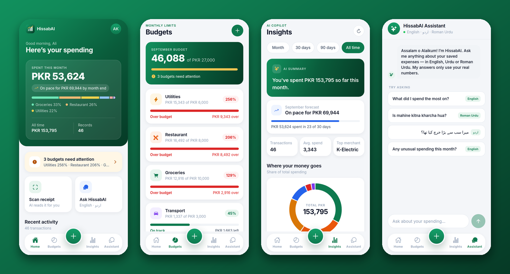
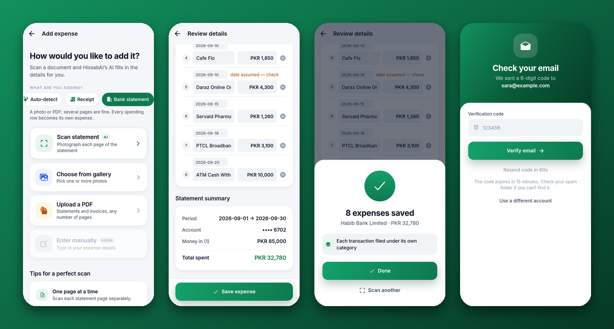
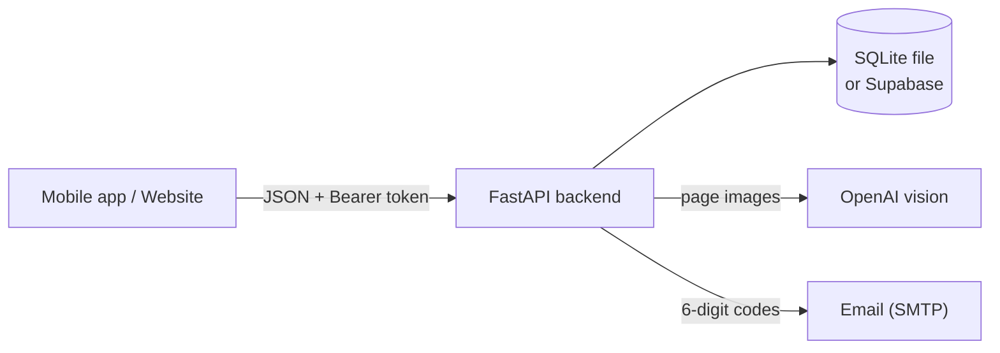

# HissabAI

**HissabAI** (*hisaab*, حساب — "accounts") is an AI-powered personal finance
copilot for Pakistan. Photograph or upload a receipt, bank statement, invoice,
utility bill or wallet screenshot; HissabAI reads it, files every expense under
the right category, tracks it against your budgets, forecasts your month, flags
unusual spending, and answers questions about your money in English, Urdu or
Roman Urdu.

It ships as a **mobile app** (Expo / React Native) and a **website** (React) that
share one **FastAPI backend** with a built-in database — no accounts to create
except an OpenAI key.

> **This branch (`mobile-app`)** contains the backend and the complete mobile app.
> The website lives on the `website` branch.

---

## Screenshots

> Captured from a running copy with the demo account (`seed_demo.py`). They were
> taken without an OpenAI key, so the AI-written text (summaries, assistant
> replies) and the document-reading step shown here are stand-in answers; the
> numbers, charts, budgets and review screens are the real application.

### Mobile app



**Adding a document, reviewing a bank statement, saving, and email verification:**



---

## What it does

- **Accounts** — sign up / sign in with **email verification**, **password
  reset** by emailed code and **login rate limiting**; every user sees only
  their own data.
- **Scan documents** — receipts, **bank statements**, **invoices**, utility
  bills and EasyPaisa / JazzCash screenshots. Take a photo, upload an image, or
  upload a **PDF** — statements and invoices can span up to 12 pages.
- **Bank statements, row by row** — each spending transaction becomes its own
  expense with its own category; printed totals and running balances are
  cross-checked before saving; saving the same statement twice never
  double-counts. Printed dates in any common format (`05/09/2026`, `05-Sep`) are
  read in code, with the year taken from the statement period; rows with no
  printed date are flagged and their date can be edited.
- **Invoices** — vendor, invoice number, dates, line items, tax, discount and
  shipping are extracted and the line, subtotal and total maths is checked.
- **Review before saving** — correct anything the AI got wrong; totals are
  validated.
- **Budgets** — a monthly limit per category with on-track / warning / over
  status.
- **Insights** — spending by category and month, a month-end forecast, unusual
  spending flags and AI-written summaries, for any date range.
- **Bilingual assistant** — ask in English, Urdu script or Roman Urdu; answers
  use only your own numbers.
- **History** — paginated transaction list with date-range and category filters.

All numbers are computed deterministically in code; the AI only reads documents
and narrates figures that were already computed (ADR-0009, ADR-0010).

---

## How it works



Uploading a document runs this pipeline on the backend:

1. **Check the file** — type, size (10 MB each, 25 MB total), PDFs rendered to
   page images (up to 12 pages).
2. **Classify** — your choice wins; otherwise image heuristics, double-checked by
   a small vision call when unsure.
3. **Quality check** every page (blur, brightness, resolution).
4. **Read** each page with the vision model, in parallel, and merge the pages.
5. **Verify in code** — totals, running balances, line maths, dates; mismatches
   become review warnings. The AI never computes a total.
6. **Review** on your phone or in the browser, then **save**. Statements are stored
   one expense per spending row, duplicate-safe.

---

## Quick start

You need **Python 3.11+**, **Node.js 20+**, and an **OpenAI API key** (the only
thing that costs money; without it you can still browse the demo data, budgets
and charts, but scanning and the AI text will say "AI reading is not configured").

```bash
# 1. Backend
python -m venv .venv && source .venv/bin/activate     # Windows: .venv\Scripts\activate
pip install fastapi httpx openai opencv-python-headless pymupdf pyjwt python-multipart uvicorn
cp .env.example .env                  # edit .env: set OPENAI_API_KEY=sk-...
cd backend
python seed_demo.py                   # optional demo data
uvicorn main:app --host 0.0.0.0 --port 8000 --reload
```

```bash
# 2. Mobile app (new terminal)
cd mobile && npm install
EXPO_PUBLIC_API_URL=http://<your-computer-IP>:8000 npx expo start      # scan the QR code with Expo Go
```

Sign in with the demo account **demo@hissabai.app / DemoPass123**, or create your
own (the verification code is printed in the backend console in development).
Full details are in the sections below.

---

## What you need before running

**Only one thing is required: an OpenAI API key** — it is what reads receipts,
statements and invoices and writes the AI summaries (platform.openai.com; paid,
and the only part that costs money). Everything else works out of the box:

| What | Needed? | Details |
|---|---|---|
| **OpenAI API key** (`OPENAI_API_KEY`) | **Yes**, for scanning and AI text | Without it you can still sign in, browse, and use budgets and charts; scanning returns "AI reading is not configured". |
| **Database** | **No** — built in | Data is stored in a local SQLite file, `backend/data/hissabai.db`, created automatically. Optionally use Supabase instead (below). |
| **Login-token secret** (`AUTH_JWT_SECRET`) | No | A random one is generated and kept in `backend/data/jwt_secret`. Set your own when you deploy. |
| **Email sending** (`SMTP_HOST`, `SMTP_PORT`, `SMTP_USER`, `SMTP_PASSWORD`, `EMAIL_FROM`) | No in development | Without it, verification and reset codes are printed in the backend console. Real deployments need an SMTP provider (Gmail app password, SendGrid, Brevo, Resend, ...). |

Settings go in a `.env` file in the project root (copy `.env.example`); the
backend reads it automatically. Never put keys in the mobile app or the website,
and never commit `.env` or `backend/data/`.

**Which database?** SQLite is the default and is ideal for a demo, a single server
and a few thousand records. Set `SUPABASE_URL` and `SUPABASE_SERVICE_ROLE_KEY`
(or `STORAGE_BACKEND=supabase`) to use hosted Postgres instead; then open the
Supabase SQL editor and run the files in `supabase/migrations/` **in order**:
`20260811000000_create_financial_records.sql`, `20260923000000_create_budgets.sql`,
`20260924000000_add_users_and_ownership.sql`, `20261002000000_auth_hardening.sql`.
The data is not copied between the two databases.

**Email in development:** with `SMTP_HOST` empty, codes appear in the backend's
console, so you can sign up and test everything without a mail account. To skip
verification entirely while developing, set `REQUIRE_EMAIL_VERIFICATION=false`.

### All settings

| Variable | Default | Purpose |
|---|---|---|
| `OPENAI_API_KEY` | — | Reads documents; writes insights and assistant answers |
| `HISSABAI_DB_PATH` | `backend/data/hissabai.db` | Where the SQLite file lives |
| `SUPABASE_URL`, `SUPABASE_SERVICE_ROLE_KEY` | — | Use Supabase instead of SQLite (service-role key stays on the server) |
| `STORAGE_BACKEND` | auto | `sqlite` or `supabase` (auto = Supabase only if `SUPABASE_URL` is set) |
| `AUTH_JWT_SECRET` | generated | Signs login tokens (≥ 32 characters); set your own in production |
| `SMTP_HOST`, `SMTP_PORT`, `SMTP_USER`, `SMTP_PASSWORD`, `EMAIL_FROM` | — | Real email for codes (port 465 = SSL, otherwise STARTTLS) |
| `REQUIRE_EMAIL_VERIFICATION` | `true` | `false` only for local development |
| `CORS_ALLOW_ORIGINS` | local dev ports | Website origins allowed to call the API |
| `TRUST_PROXY_HEADERS` | off | `true` behind your own reverse proxy so rate limits see real client IPs |
| `AI_CLASSIFIER` | on | `off` disables the extra vision call that identifies document types |

---

## 1. Run the backend (required by both apps)

Requirements: Python 3.11+.

```bash
python -m venv .venv && source .venv/bin/activate     # Windows: .venv\Scripts\activate
pip install fastapi httpx openai opencv-python-headless pymupdf pyjwt python-multipart uvicorn
# (or, with uv:  uv sync)

cp .env.example .env              # then edit .env and set OPENAI_API_KEY=sk-...
cd backend
python seed_demo.py               # optional: demo account + 3 months of sample spending
uvicorn main:app --host 0.0.0.0 --port 8000 --reload
```

`seed_demo.py` creates **demo@hissabai.app / DemoPass123** (already verified) with
75 categorised expenses and four budgets, so every screen has data immediately.

Check it: `curl http://localhost:8000/health` → `{"status":"ok"}`.
Interactive API docs: <http://localhost:8000/docs>.


## 2. Run the mobile app

Requirements: Node.js 20+, and either the **Expo Go** app (Android) on your
phone or an Android emulator.

```bash
cd mobile
npm install
```

Tell the app where your backend is with `EXPO_PUBLIC_API_URL`, then start it:

| Where the app runs | Value of `EXPO_PUBLIC_API_URL` |
|---|---|
| **Physical phone** (same Wi-Fi as your computer) | `http://<your-computer's-LAN-IP>:8000` e.g. `http://192.168.1.20:8000` |
| **Android emulator** | nothing needed (defaults to `http://10.0.2.2:8000`) |

```bash
# macOS / Linux
EXPO_PUBLIC_API_URL=http://192.168.1.20:8000 npx expo start

# Windows PowerShell
$env:EXPO_PUBLIC_API_URL="http://192.168.1.20:8000"; npx expo start
```

Scan the QR code with Expo Go (or press `a` for an emulator). Then:

1. **Create account** on the first screen, then enter the 6-digit code from the
   verification email (in development it is printed in the backend console).
   *Forgot password?* on the sign-in screen resets it the same way.
2. Tap **＋** → choose what you are adding (Receipt, Bank statement, Invoice, …) →
   **Scan** with the camera, **Choose from gallery**, or **Upload a PDF**. For
   statements and invoices use **Add another page** to build a multi-page document.
3. Check the extracted details, edit anything wrong (including a statement row's
   date), **Save**.
4. Explore Home, Budgets, Insights and the Assistant tabs.

Type-check with `cd mobile && npx tsc --noEmit`.


---

## API overview

All endpoints are under `/api/v1` and (except `/health`, sign-up, sign-in and
password reset) need `Authorization: Bearer <token>` from an email-verified
account. Full request/response details are in [`docs/api-contract.md`](docs/api-contract.md)
and, with the backend running, at <http://localhost:8000/docs>.

| Area | Endpoints |
|---|---|
| Auth | `POST /auth/signup` · `/auth/login` · `GET /auth/me` · `POST /auth/verify-email` · `/auth/resend-verification` · `/auth/forgot-password` · `/auth/reset-password` |
| Documents | `POST /receipt/upload` (image(s) or PDF, optional `document_type`) |
| Expenses | `GET /financial-records` (paging, `start_date`, `end_date`, `category`) · `POST /financial-records` |
| Insights | `GET /insights` · `GET /insights/summary` (no AI) · `POST /insights/ask` — all accept `start_date` / `end_date` |
| Budgets | `GET /budgets` · `PUT /budgets/{category}` · `DELETE /budgets/{category}` |

---

## Tests

```bash
cd backend && python -m unittest discover -s tests -p "test_*.py" -t tests
```

The backend suite covers the parsers and their maths checks, PDF and multi-page
handling, both database stores (including a full run of the real app on a real
SQLite file), login, verification, reset and rate limiting.


---

## Troubleshooting

| Symptom | Fix |
|---|---|
| Scanning says "The server has no OpenAI API key" | Add `OPENAI_API_KEY=sk-...` to `.env` and restart the backend. |
| "Check your email" but no email arrives | Without `SMTP_HOST` the code is printed in the backend console. For real email, set the SMTP variables. |
| Everyone was signed out after a restart | `AUTH_JWT_SECRET` changed or the generated secret file was wiped; set a fixed `AUTH_JWT_SECRET`. |
| "Too many sign-in attempts" | 5 wrong passwords lock an email for 15 minutes; wait, or reset the password. |
| The phone cannot reach the backend | Same Wi-Fi, firewall open for port 8000, backend started with `--host 0.0.0.0`, and `EXPO_PUBLIC_API_URL` set to your computer's LAN IP (not `localhost`). |
| A white page photo is rejected as overexposed | Choose "Bank statement" or "Invoice" before scanning; receipts are judged more strictly. |

---

## Repository layout

```
backend/        FastAPI backend: routes/, services/, parsers/, schemas/, prompts/, tests/
                (data/ holds the SQLite database; seed_demo.py adds sample data)
supabase/       SQL migrations (only needed if you choose Supabase)
docs/           Architecture, API contract, decision records (ADRs), screenshots
mobile/         Expo / React Native app
```

Documentation: [`docs/api-contract.md`](docs/api-contract.md) ·
[`docs/architecture.md`](docs/architecture.md) · [`docs/adr/`](docs/adr) ·
[`progress-log.md`](progress-log.md).

---

## Credits and contributions

HissabAI builds on **KharchAI**, an earlier team codebase used with its
authors' permission. It provided the FastAPI document pipeline (receipt,
utility-bill and wallet-screenshot parsing, validation, confidence scoring,
review hints), Supabase persistence, and the original Expo mobile app (receipt
capture, review and save flow). The original commit history is preserved in
this repository.

Work added on top of that base:

- **AI financial reasoning layer** — deterministic calculations plus
  LLM-generated insights, recommendations and grounded Q&A (ADR-0009).
- **Smart categorisation, budgets, forecast and unusual-spending detection**
  (ADR-0010).
- **Bilingual AI assistant** (English, Urdu, Roman Urdu).
- **Accounts and per-user data** — scrypt passwords, signed tokens, every route
  protected and scoped (ADR-0011).
- **Bank statement parsing** with deterministic balance checks and per-row
  expenses, **date-range filtering** and **pagination** (ADR-0012).
- **Auth hardening** — emailed-code email verification and password reset,
  session revocation, login/sign-up/reset rate limiting (ADR-0013).
- **Multi-page PDFs and photos, invoices, a vision-model document classifier and
  robust statement dates** (ADR-0014).
- **A built-in SQLite database, `.env` loading and demo data** so the project runs
  without external services (ADR-0015).
- **Mobile redesign** — design system, motion, haptics, scan-type picker,
  statement review.

---

## Known limitations

- Document reading was developed against stand-in AI responses; its accuracy on
  real Pakistani receipts and statements depends on the OpenAI model and should be
  checked with your own documents before relying on it.
- SQLite (the default database) suits a demo, one server and a few thousand
  records; use Supabase for anything larger. Data is not copied between them.
- Rate-limit counters live in the backend process, which is right for a single
  worker; with several workers each keeps its own counts (swap
  `services/rate_limit.py` for Redis or the database before scaling out).
- No two-factor authentication, and email delivery depends on your SMTP provider.
- Statements and invoices are limited to 12 pages and 10 MB per file (25 MB
  total). PDFs are rendered to images and read visually; password-protected PDFs
  are refused.
- The vision-model classifier adds one small extra call to an auto-detected
  upload. A mostly-white page photographed *without* choosing "Bank statement" or
  "Invoice" may be rejected as overexposed, because receipts are judged more
  strictly; choosing the type fixes it.
- A statement date that is printed but unreadable stays blank (and is flagged)
  rather than being guessed; undated rows take the previous row's date and are
  flagged for you to check.
- Saved expenses cannot yet be edited or deleted from the apps.
- The mobile app has been run in a browser preview but not yet on a physical phone.
